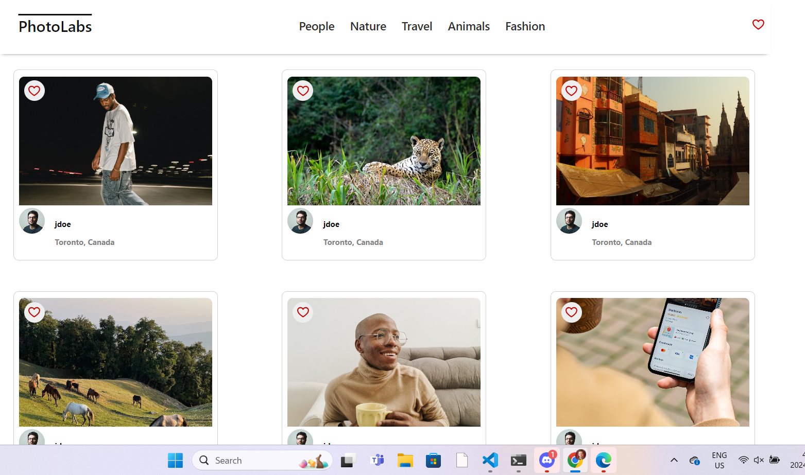
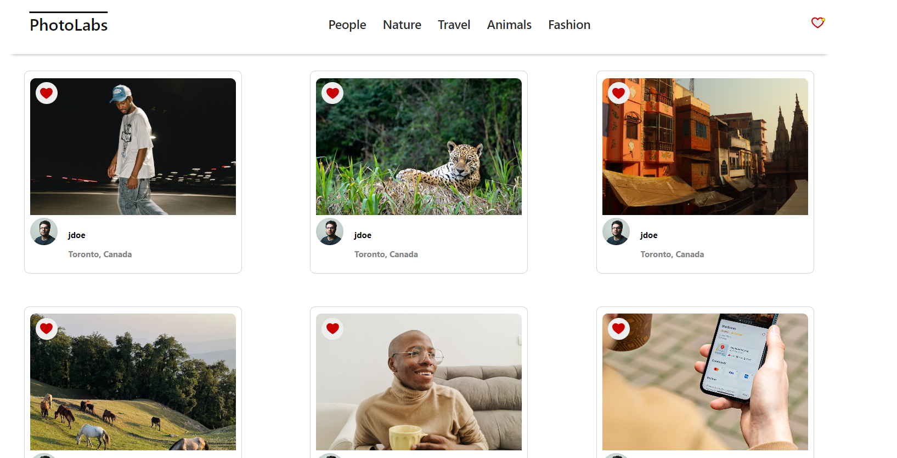
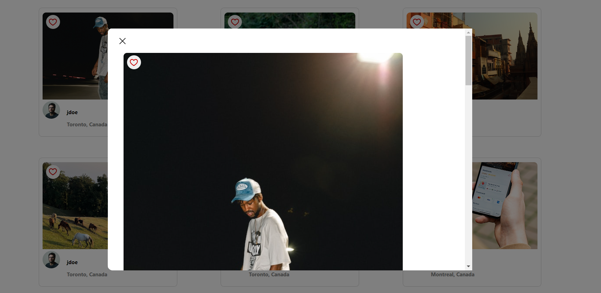

# react-photolabs
The PhotoLabs project for the Web Development React course programming.

# Photolabs

## Setup

Install dependencies with `npm install` in each respective `/frontend` and `/backend`.

## [Frontend] Running Webpack Development Server

```sh
cd frontend
npm start
```

## [Backend] Running Backend Servier

Read `backend/readme` for further setup details.

```sh
cd backend
npm start
```
# Matt's Photolab
This is my first full stack app, you can load photos from the database and like photos and view a close up version of the photo.

## Features
This will display all photos from a database on first load. If you favourite a photo you will be notified by the heart on the top right. 

If you select a topic, it will only show photos relating to that topic. Your favourites will be remembered though.

## Homepage


## Favourited


## Modal
